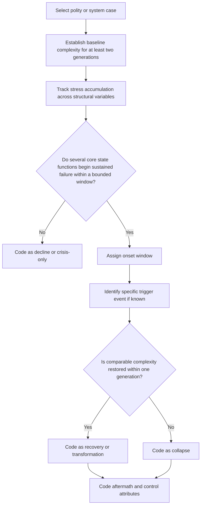

# Stream Three Method Memo

## Executive Summary

This memo sets the methodological standard for Stream Three by treating collapse as a specific transition from accumulated stress into rapid, sustained sociopolitical simplification rather than as a synonym for hardship, decadence, or dramatic historical mood. The framework is deliberately hierarchical. entity["people","Joseph A. Tainter","American anthropologist"] and entity["book","The Collapse of Complex Societies","1988 book by Joseph A. Tainter"] provide the outcome definition. entity["people","Eric H. Cline","American archaeologist"], entity["book","1177 B.C.: The Year Civilization Collapsed","2014 book by Eric H. Cline"], and entity["book","After 1177 B.C.: The Survival of Civilizations","2024 book by Eric H. Cline"] provide the best applied model of an interconnected macro-system in which collapse is cascading, uneven, and followed by divergent trajectories including resilience and transformation. entity["people","Peter Turchin","American evolutionary anthropologist"], entity["book","End Times","2023 book by Peter Turchin"], and entity["book","Secular Cycles","2009 book by Peter Turchin and Sergey Nefedov"] add discriminating power on the pressure side by separating structural causes from triggers and by specifying measurable drivers such as elite overproduction, popular immiseration, and state fiscal distress. entity["people","Lawrence Freedman","British historian"] and entity["book","Strategy: A History","2013 book by Lawrence Freedman"] justify treating literary and narrative materials as strategic evidence about what a polity can imagine and sustain, rather than as decorative atmosphere. The uploaded project brief makes this exact methodological discipline central to the entire project. fileciteturn1file0 citeturn4view0turn5view0turn29view0turn15view0turn25view0turn19view0

The core recommendations are straightforward. The default unit of analysis should be the polity or governing regime, not “civilization” in the loose cultural sense, because Tainter’s definition is fundamentally political; civilization should function as a narrative frame above the coded unit unless a genuinely integrated macro-system warrants a second, system-level case. Collapse onset should usually be coded as an interval rather than a single date, with separate fields for baseline, stress accumulation, onset window, trigger event, terminal simplification point, and aftermath, because both Cline’s Late Bronze Age work and Turchin’s framework warn against conflating long-build structural pressure with the event that makes the crisis legible. Control groups should include both near-collapse recoveries and high-stress transformations, since “non-collapse” is not one outcome but several. Finally, the variable schema should combine social-complexity measures, structural-pressure measures, trigger/cascade measures, aftermath measures, and a literary-strategic module that tracks narrative coherence, legitimacy scripts, temporal mood, center-periphery fracture, and moral language. fileciteturn1file0 citeturn4view0turn5view0turn29view0turn26view5turn30view0turn30view1

## Mandate and Source Basis

The project foundation document makes three commitments non-negotiable: collapse must be operationally defined; every signature claim must be tested against controls that experienced comparable stress without collapsing; and the project must eventually produce falsifiable predictions about present-day systems. It also explicitly names Stream Three as the methodological core and treats the literary archive of a civilization as evidence about internal self-understanding rather than as ornament. That combination means this memo cannot be merely conceptual. It has to produce rules that are strict enough to code cases, loose enough to survive uneven historical evidence, and clear enough to travel across tools without ambiguity. fileciteturn1file0

The source hierarchy for this memo therefore places first the primary methodological spine: Tainter on what collapse is, Cline on how to study an interdependent collapse empirically, Turchin on how to formalize social pressure and instability, and Freedman on why strategy has always involved scripts, stories, and historical exemplars rather than only plans and institutions. I then used wider disciplinary correctives where they sharpened boundaries: Guy Middleton’s warning against monocausal or mythic “collapse” stories, PNAS work stressing that stressed societies have varied and often unpredictable outcomes, and database-building efforts such as entity["organization","Seshat: Global History Databank","historical database project"] and the historical CrisisDB project, which demonstrate how large comparative datasets can distinguish crisis, transformation, and recovery rather than selecting only famous collapses. citeturn13view0turn13view1turn16search0turn16search1turn30view0turn30view1turn30view2

The right way to read these sources together is not to force them into a single theory. Tainter should define the outcome. Turchin should refine the pre-collapse pressure field. Cline should discipline our onset dating and our treatment of system-level interdependence. Freedman should govern how we treat literary and narrative texts as evidence of strategic imagination, legitimacy, and agency. Middleton and the broader archaeology literature should function as a standing caution against the seductive but destructive habit of reducing every complex historical breakdown to one cause or one dramatic year. citeturn4view0turn29view0turn15view2turn25view0turn13view0turn17search7

## Defining Collapse

Tainter’s definition remains the best anchor because it is narrow enough to code and broad enough to travel across eras. In the formulation summarized in a later scholarly chapter that directly reproduces his argument, collapse is a political process marked by a rapid, significant loss of an established level of sociopolitical complexity. “Established” matters because the system must have sustained that complexity for more than one or two generations; “rapid” matters because losses that stretch too long become decline rather than collapse; and “sociopolitical complexity” matters because the relevant object is not civilization as sentiment, style, or memory but governing complexity in its coercive, extractive, administrative, and coordinating forms. The same source also underscores a point that should matter to this project: for Tainter, collapse is not just failure but simplification as an adaptation, which means the framework should be able to capture why some actors experience collapse as relief, decentralization, or survivable reorganization. Later statements from Tainter likewise keep returning to the same mechanism: societies solve problems by adding complexity, complexity requires energy, and vulnerability grows when investments in complexity reach diminishing returns. citeturn4view0turn27view0turn27view1turn27view2turn27view3turn20search1

Cline’s post-1177 work is especially useful because it shows why the project must distinguish collapse from transformation rather than opposing them as mutually exclusive absolutes. In his own account of the Late Bronze Age aftermath, some societies experienced near-complete collapse, some were resilient, and some transformed into new, still-functional configurations. He argues that saying there was “only transformation” understates the real human violence and loss, but he equally insists that the aftermath was heterogeneous: different regions fell at slightly different times and took different roads toward recovery or failure. That is exactly the distinction this book needs. “Collapse” should remain available for cases where established political systems and coordinating frameworks break down sharply and stay broken. “Transformation” should be used where reorganization occurs at comparable or eventually comparable complexity. “Decline” should be reserved for slower, extended erosions that do not cross the threshold into rapid simplification. citeturn29view0turn5view0

The coding rule I recommend is shown below. It is a synthesis, not a direct quotation, but it is tightly tied to the source base above.

| Outcome class | Operational test | Default time rule | Coding implication |
|---|---|---|---|
| Collapse | Rapid and sustained simplification across several core domains of sociopolitical complexity, with no restoration to roughly prior complexity within one generation | Prefer 25 years when evidence allows; never more than 50 years unless chronology is too coarse to split finer | Count as positive collapse case |
| Decline | Material weakening or institutional erosion without a sharp threshold break into simplified governance | More than 50 years, or no clear inflection | Do not count as collapse case |
| Transformation | Major reorganization with substantial continuity or later restoration of comparable complexity under new institutions | Can be rapid or extended | Count as non-collapse comparison, not collapse |
| Near-collapse recovery | Acute crisis with clear stress bundle and visible system impairment, but recovery to near-baseline complexity within one generation | Usually 5–30 years | Count as primary control case |

This table implies a stricter practical threshold than collapse writing usually applies in public discourse. A famine, capital flight episode, civil war, dynastic overthrow, or cultural pessimism is not enough by itself. To code collapse, the evidence should show downward movement in several governing dimensions at once, such as fiscal extraction, central administrative reach, military command, communications/logistical integration, urban hierarchy, or legal-archival continuity. That multi-domain requirement follows directly from Tainter’s insistence that collapse is loss of established complexity rather than any one shock and from Cline’s demonstration that large breakdowns often consist of concatenated failures rather than single-cause events. citeturn4view0turn29view0turn12search2

## Dating Onset

The project’s onset problem is real, and the best answer is to stop pretending that every collapse begins on a single neatly datable day. Cline’s public summaries of the Late Bronze Age case make exactly the point the book needs: 1177 BCE is a defining and legible moment, but the interlinked collapses played out over about a century, not in one instant, and different societies were affected at somewhat different times. His later reflections sharpen this still further by arguing that each society took a distinct trajectory and that the overall end of the Late Bronze way of life occurred “shortly after 1200 BC” at different local tempos. Turchin makes a complementary point from a different direction: social breakdown is driven by deep structural pressures that accumulate over time, while the actual outbreak is often triggered by contingent events. In his own analogy, social crises resemble earthquakes: structural strain builds, but the precise rupture point and its immediate trigger are not perfectly predictable. Archaeological work on early warning signals and resilience also points in the same direction, suggesting that declining resilience often precedes visible demographic or political collapse. citeturn5view0turn29view0turn26view5turn18search0turn18search6

The implication is that the project should code six temporal fields, not one: baseline period, stress-accumulation period, onset window, trigger date if known, terminal simplification point, and aftermath/recovery period. The onset window is the most important field. It should capture the earliest interval in which simplification becomes self-reinforcing and no longer looks like an ordinary crisis fluctuation. The trigger date is subordinate to that field. A famous battle, sack, debt default, rebellion, harvest failure, or assassination may make the process visible, but visibility is not identical to onset. This is the central methodological correction that will prevent the project from turning vivid dates into false causal anchors. citeturn5view0turn26view5turn29view0

A workable onset rule for the dataset is this: code the onset of collapse at the earliest date or interval when at least three of the core complexity domains begin a sustained downward break and the center’s coordinating capacity is visibly impaired, with no return to roughly prior complexity within one generation. When evidence is thin, code onset as a bounded interval rather than a point estimate. When evidence is better, use a point date plus a confidence score. For Late Bronze Age-style macro-systems, the method should permit both a system-level onset window and polity-level onset windows beneath it. That dual-level approach is not optional; it is the only way to preserve Cline’s insight that a connected world can fail unevenly while still undergoing a real systems collapse. citeturn4view0turn5view0turn29view0turn30view0

The practical test is worth stating in plain language. Stress is not onset. Trigger is not onset. Iconic date is not onset. Onset begins when the crisis crosses from burden into irreversible or near-irreversible simplification. For the Late Bronze Age, that means 1177 BCE should usually be coded as a synchronization shock or emblematic crisis point, while the onset window for particular constituent polities may begin earlier. That distinction will later matter enormously when the book moves from ancient cases to modern financial or technological systems, where spectators nearly always mistake the visible event for the process that made the event decisive. citeturn5view0turn29view0turn26view5

## Comparative Design

The project brief is right to insist that no alleged “signature” is valid unless tested against controls, because collapse research is uniquely vulnerable to selecting on the dependent variable. Wider scholarship supports that caution. A major comparative feature on historical collapse showed that societies under stress do not all end the same way and that outcomes are often complex and unpredictable. Middleton’s survey of collapse scholarship also argues against monolithic explanatory models and stresses resilience, agency, and variability. Turchin’s current CrisisDB project is organized around exactly this question: why some societies remain in crisis, some recover, and some break down more fully. That is the comparative logic this memo adopts. fileciteturn1file0 citeturn16search0turn16search1turn13view0turn30view1

The first rule of case design should therefore be unit discipline. The default case should be a polity, regime, or genuinely integrated governing system, because that is the scale at which extraction, coercion, administration, communications, and legitimacy are organized. Culture or civilization is still crucial, but primarily as context and as a source archive for the literary-strategic layer. A civilization-level case should only be coded when multiple polities are so strongly interdependent that their breakdown can defensibly be treated as a system event. Cline’s Late Bronze world qualifies; a loose family of culturally related but administratively separate societies generally will not. This rule also aligns with the practice of Seshat, which codes polities pragmatically as units of analysis and then tracks their variables across time. citeturn4view0turn5view0turn30view0turn23search14

The second rule is that the project should distinguish two kinds of controls rather than one. Recovery controls are systems that entered severe crisis but returned to near-baseline complexity. Transformation controls are systems that underwent deep reorganization yet preserved or reconstituted complexity at a comparable level. Cline’s post-1177 framework makes this distinction especially clear: Assyrians and Babylonians appear as resilience cases, Cypriots and Phoenicians as transformation cases, while Mycenaean and Hittite outcomes are much closer to collapse. If the book treats all non-collapse cases as one pile, it will miss what may turn out to be the most important discriminant: not whether stress occurred, but whether the system absorbed it by recovery, reconfiguration, or simplification. citeturn29view0

The dataset admission rule I recommend is below.

| Inclusion gate | Requirement | Reason for the gate |
|---|---|---|
| Defined unit | A polity/regime by default; a macro-system only when integration is demonstrably high | Prevents “civilization” from becoming an undisciplined bucket |
| Established baseline | Evidence of sustained complexity for at least two generations before crisis | Follows Tainter’s baseline requirement |
| Dateable onset | An onset point or bounded onset interval can be defended from evidence | Prevents purely impressionistic cases |
| Multi-domain evidence | At least three core complexity domains can be coded with usable evidence | Prevents one-variable collapses |
| Aftermath visibility | At least one generation after onset is visible in the record | Allows distinction between collapse, transformation, and recovery |
| Control availability | At least one plausible matched non-collapse comparator exists | Enforces the signature test |
| Literary-strategic evidence | A late-period corpus or contemporaneous textual/epigraphic substitute exists, or the case is explicitly limited to quantitative coding only | Preserves the distinctiveness of Stream Three |

Control matching should prioritize similarity in system type, scale, energy regime, integration level, and stress bundle rather than similarity of geography alone. A good control for a heavily financialized modern system is not an agrarian kingdom just because both experienced debt distress; a good control for a palace-network macro-system is not any state that had a drought. The higher the similarity in pressure structure, the more persuasive the eventual signature claims will be. In practice, each collapse case should ideally have one “near” control and one “stretch” control: one very close case to test false positives, and one somewhat looser but still relevant case to test whether the signal survives a change of context. fileciteturn1file0 citeturn16search0turn30view1

## Variable Schema

The variable architecture should borrow the best existing comparative scaffolds without allowing them to flatten the project into pure quantification. Seshat already provides a public menu of social-complexity variables such as polity territory, polity population, settlement hierarchy, merit promotion, formal legal code, roads, and postal stations. CrisisDB explicitly combines demographics, elite numbers, coin hoards, skeletal evidence of violence, state expansion and contraction, epidemics, famines, and related variables to build pictures of crisis and recovery. Turchin’s Political Stress Index supplies the triadic logic the project needs on the pressure side by combining mass mobilization potential, elite mobilization potential, and state fiscal distress. The project brief adds a further requirement that no purely material schema can satisfy on its own: a literary-strategic layer able to show how late-period actors understood legitimacy, time, danger, and the imaginable future. Freedman’s work supports that addition by treating strategy historically as something learned from classics, scripts, and narratives as well as from formal plans. fileciteturn1file0 citeturn30view0turn30view1turn26view5turn15view0turn25view0turn19view0

The schema below is the recommended first version.

| Module | Core variables | Preferred coding type | Purpose in the method |
|---|---|---|---|
| Case identity | case_id, polity/system name, region, date bounds, system type, scale level | Categorical + interval | Keeps units consistent |
| Baseline complexity | territory, population, settlement hierarchy, centralization, bureaucratic depth, legal-archival routinization, transport/information infrastructure, military organization | Ordinal or quantitative where possible | Establishes “established complexity” before crisis |
| Structural pressures | elite turnover/elite overproduction, inequality, labor pressure or immiseration, fiscal distress, debt burden, military burden, climate/resource stress, trade-network dependency, succession strain, epidemic/famine burden | Mixed | Captures the pressure field before rupture |
| Trigger and cascade | invasion, revolt, assassination, harvest failure, earthquake, bank run, default, secession, trade cutoff, technological shock | Event log | Distinguishes triggers from structural causes |
| Simplification outcome | territorial contraction, loss of central extraction, collapse of command, archive interruption, urban contraction, demilitarization, fragmentation of hierarchy, administrative de-specialization | Ordinal + event log | Measures the collapse threshold itself |
| Recovery or transformation | successor complexity, restoration time, persistence of institutions, innovation/substitution, decentralization durability, re-integration | Ordinal + interval | Separates recovery, transformation, and collapse aftermaths |
| Literary-strategic signals | legitimacy narrative, golden-age nostalgia, elite self-indictment, apocalyptic or providential tone, center-periphery estrangement, paralysis versus agency, corruption/decadence language, exile/displacement themes, moral order fracture, renewal scripts | Ordinal + excerpt-based coding | Tracks what actors believed was happening and what futures they imagined |
| Evidence and uncertainty | source type, date precision, evidentiary conflicts, confidence level, excerpt/quotation anchors | Metadata | Keeps every code auditable |

The literary-strategic module deserves special emphasis because it is where this project can become more than a standardized crisis database. The goal is not “sentiment analysis for classics.” The goal is to code how a society narrates authority, disorder, destiny, and the possibility of action when ordinary institutional language begins to fail. Freedman’s historical treatment of strategy ranges from epic and classical examples through modern strategic thought, and his later discussion of strategic narratives emphasizes that people make sense of conflict through plots, subjects, and conclusions that shape response. The brief’s literary premise goes in the same direction: late-period texts can reveal whether foundational stories are being upheld, hollowed out, weaponized, inverted, or replaced. In coding terms, the key latent variable here is narrative coherence under stress. That variable should later become one of the bridges from Stream Three into Streams One and Two. fileciteturn1file0 citeturn11search1turn25view0turn19view0

A practical rule for the literary corpus is this: code texts comparatively, not in isolation. For each case, compare late-period materials against earlier or canonical materials from the same tradition when possible, and code shifts in tone, legitimacy claims, time horizon, enemy construction, and moral vocabulary. That is the only way to avoid projecting modern despair into every body of dark or tragic literature. It also aligns with Freedman’s insistence that strategic scripts are learned historically and with Cline’s warning that uneven outcomes can coexist inside one wider collapse. citeturn25view0turn29view0

## Confidence Taxonomy and Immediate Next Steps

The brief already instructs the project to cleanly separate verified primary-source material, secondary synthesis, and analytical inference. The simplest usable taxonomy is a five-level scale. The point is not merely epistemic modesty. It is to keep later prose honest when it moves from hard chronology and administrative breakdown to literary interpretation and cross-case analogies. fileciteturn1file0

| Level | Meaning | Use in case coding |
|---|---|---|
| A | Contemporaneous primary evidence or directly measured data with secure chronology | Can anchor onset windows and outcome calls |
| B | Strong reconstruction supported by multiple independent scholarly sources | Can support coding with a brief uncertainty note |
| C | Plausible but contested reconstruction, weak chronology, or single-source dependence | May be coded only with explicit caution flag |
| D | Analytical inference from mixed evidence, including literary synthesis and cross-case reasoning | Keep separate from factual fields; use in memo interpretation |
| E | Speculative or too weak to code | Note in comments, exclude from analytic fields |

The belief that one case should receive one global confidence score is a mistake. Confidence should be attached to variables, dates, and interpretations separately. A case may have Level A confidence for a city’s destruction horizon, Level B confidence for territorial contraction, Level C confidence for demographic loss, and Level D confidence for the meaning of its late poetry. That granularity will preserve analytic honesty and prevent later chapter drafts from turning elegant synthesis into unearned certainty. citeturn13view0turn30view1turn30view2

The immediate next step is to convert this memo into a reusable case template and then pilot it on a deliberately mixed calibration set: one clear collapse case, one clear transformation case, and one clear near-collapse recovery control. That three-part pilot is better than beginning with only famous collapses because it will force the thresholds to show their work at the boundaries where the project is most likely to drift into rhetoric. A strong first calibration set would also test the dual-level rule by using one macro-system case alongside subcases. That would allow the project to settle, early, whether it is really able to distinguish system failure from subsystem divergence. citeturn29view0turn30view1turn30view0

No blocker-level information is required from Jeff to begin using this method. The remaining decisions are mostly defaults that can be frozen during pilot coding: the first exact case-control triad, whether one generation should be fixed at 25 years across all cases unless specified otherwise, and whether macro-system cases should always be paired with polity-level subcases where the evidence allows. My recommendation is yes on all three. That will produce a schema strict enough to constrain later interpretations but flexible enough to survive the unevenness of the historical record. fileciteturn1file0
