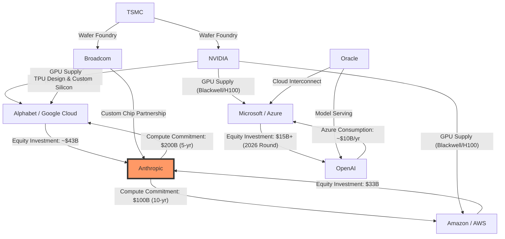

# AI Circular-Investment Web — Visual Exhibit

**Stream:** One — Data Ledger & Financial Architecture
**Date:** 2026-05-10
**Author:** Gemini
**Status:** Centerpiece exhibit for May 15 synthesis

---

## The Anthropic Concentration Diagram

---

## Prose Key & Narrative Analysis

- **Anthropic as Concentration Point:** Anthropic is the "Cross-Channel" node. It is simultaneously a major equity beneficiary of Alphabet (~$43B) and Amazon ($33B), while acting as a massive revenue backlog for both.

- **Circular Revenue (Issuer Confirmed):** The $200B commitment from Anthropic to Google Cloud (May 2026) and the $100B commitment to AWS are issuer-confirmed in recent partnerships. This effectively converts the hyperscalers' "Investing Cash Flow" (investing in Anthropic) into "Operating Revenue" (Anthropic buying cloud).

- **The Broadcom/TPU Axis:** Broadcom is the "Silent Enabler," facilitating Google's move away from NVIDIA reliance via TPUs, while Anthropic serves as the primary "sovereign customer" for this custom silicon.

- **Magnitude Divergence:** While Microsoft remains tied to OpenAI, the Google/Amazon "Anthropic Hedge" has reached a magnitude ($300B+ in commitments) that now rivals the Microsoft/OpenAI ecosystem.

---

## Edge Confidence Notes

| Edge | Source class |
|---|---|
| Alphabet → Anthropic ($43B equity) | Issuer-confirmed (Q1 2026 10-Q discloses $40B private-co commitment; Reuters attributes to Anthropic) |
| Anthropic → Google Cloud ($200B/5yr) | Secondary-reported (The Information; >40% of GCP backlog) |
| Amazon → Anthropic ($33B equity) | Issuer-confirmed |
| Anthropic → AWS ($100B/10yr) | Issuer-confirmed (October 2025 announcement, expanded April 2026) |
| Microsoft → OpenAI ($15B+) | Issuer-confirmed |
| OpenAI → Azure (~$10B/yr) | Estimated; not separately disclosed |
| NVIDIA GPU supply edges | Issuer-confirmed across all three hyperscalers |
| Broadcom → Alphabet (TPU design) | Issuer-confirmed (long-term agreement through 2031) |
| TSMC foundry edges | Industry-confirmed |
