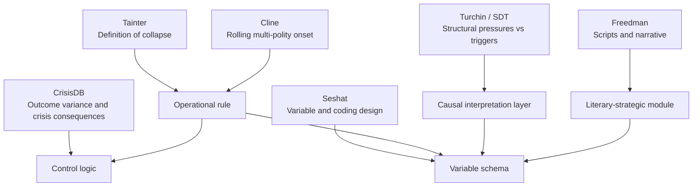
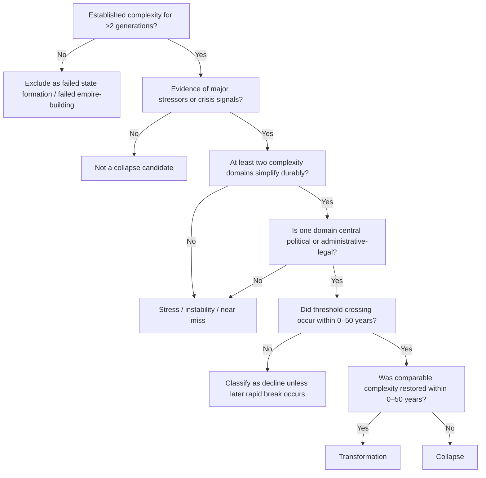

# Stream Three Method Memo

## Executive Summary

This memo sets the methodological spine for Stream Three. Its core recommendation is to operationalize collapse narrowly, at the polity level first and the civilizational level second. The base definition should remain entity["people","Joseph Tainter","collapse scholar"]’s: collapse is a rapid and significant loss of an established level of sociopolitical complexity, not merely stress, not slow deterioration, and not successful reorganization at comparable complexity. Tainter’s own framing makes three things unusably vague unless the project sharpens them: what counts as “rapid,” what exactly is being simplified, and how to separate collapse from survival-through-transformation. citeturn23view0turn18view0

The best way to sharpen those ambiguities is to combine four bodies of work rather than forcing any one of them to do all the labor. Tainter supplies the definitional center and the simplification test. entity["people","Eric H. Cline","archaeologist"]’s work on the Late Bronze Age supplies a practical lesson in onset dating: region-wide “collapse” is usually a rolling sequence of polity-level breakdowns, recoveries, and transformations that do not happen on one date. entity["people","Peter Turchin","historical social scientist"] and CrisisDB add discriminating power by distinguishing slowly accumulating structural pressures from shorter-term triggers, and by insisting that crisis outcomes vary widely rather than following one fixed script. entity["people","Lawrence Freedman","strategist and historian"] adds the literary-strategic insight that elites and states act through scripts, narratives, and imagined futures, which makes a literary-strategic module analytically necessary rather than decorative. citeturn16view5turn16view6turn16view7turn16view8turn22search14turn16view1turn16view3turn16view4turn8search1turn25view0turn13search2turn13search13turn13search14

The memo therefore recommends a two-level coding structure. First, every case gets a polity-level onset date, because that is the analytically cleanest unit for simplification. Second, where warranted, the project may also assign a civilizational episode window that recognizes staggered or networked collapse across multiple linked polities, as in Cline’s Bronze Age example. This prevents the project from forcing a false single-year onset on cases that are genuinely sequential or system-wide. citeturn16view5turn16view8turn14view7

For classification, this memo proposes explicit time rules. Collapse should require threshold-crossing simplification within roughly half a century at the polity level, with no recovery to comparable complexity inside the next half century. Decline should be reserved for materially similar erosions that unfold more slowly. Transformation should name cases where severe disruption is followed by reconstitution at comparable or greater complexity within a relatively short interval, even if the ruling elite, dynastic line, or ideological frame changes. These time rules are inferential extensions of Tainter and Cline rather than quotations from them, but they follow directly from Tainter’s “few decades” criterion and Cline’s demonstration that not all heavily stressed societies vanish in the same way. citeturn23view0turn18view0turn16view6turn16view7

The memo also recommends a strict control strategy. Every collapse case should be paired with at least one near control and one stretch control. Near controls are polities in the same broad era and region that faced an overlapping stress bundle but avoided collapse. Stretch controls are more distant analogues that faced similar structural pressures under different cultural or institutional conditions. This approach is consistent with the uploaded foundation document’s insistence on controls and is strongly reinforced by CrisisDB findings that there is no single typical crisis and by recent work on “crises averted,” which shows that some societies facing severe structural pressures still managed adaptive reform. citeturn8search1turn16view3turn16view4turn29search1turn29search4turn10search1turn10search3

Finally, the variable schema should deliberately combine quantitative, ordinal, categorical, event-based, and textual coding. entity["organization","Seshat: Global History Databank","historical database project"] is especially useful here because it already demonstrates how to mix ranges, presence-absence states, structured event records, and text-backed qualitative nuance within one framework, while CrisisDB shows how to encode crisis events, consequences, and recovery paths. The project should build on that logic rather than inventing an all-text or all-quant model. citeturn25view1turn17view0turn17view2turn17view3turn17view4turn17view5turn17view6turn17view7turn17view8turn17view9

## Repository Context and Execution Status

I reviewed the uploaded foundation document locally and used it as the governing project context. That document clearly makes Stream Three the methodological core of the broader project and places special emphasis on Tainter’s definition, controls against selection-on-the-dependent-variable, and a literary-civilizational reading practice. Those instructions are reflected throughout this memo.

One material limitation remains open. I could not access the repository context directly from the current environment, so I could not verify `_TOOL_INSTRUCTIONS.md`, inspect the live `methodology` tree, or execute a direct repository commit. Because of that, I am treating the user-specified fallback path and commit message as the working convention: `/methodology/stream_three/method_memo_v1.md` with commit message `Add Stream Three method memo v1`. The repository that should receive this artifact is urlcollapse-signature-research repositoryhttps://github.com/jefrix/collapse-signature-research.

The operative brief, reduced to its essentials, is straightforward: build a method memo before any dispatches or chapters; define collapse onset rigorously; distinguish collapse from decline and transformation with time rules; specify inclusion criteria and control logic; create a confidence taxonomy; and define the variable schema, including a literary-strategic module. The memo below is written to satisfy exactly that brief.

### Deliverable Outline

| Memo component | What it is for | Minimum output in this memo |
|---|---|---|
| Executive summary | Give Jeff and Claude the usable core quickly | One-page synopsis of definitions, rules, controls, schema, and open items |
| Operational definition | Fix the meaning of collapse before case collection | Tainter-based definition plus observable simplification domains |
| Onset rules | Prevent arbitrary start dates | Explicit polity-level and civilizational-window dating rules |
| Distinction rules | Separate collapse from decline and transformation | Time-based decision rules with recovery tests |
| Inclusion gates | Keep the dataset auditable | Required source floor, complexity floor, and comparability floor |
| Control logic | Make signature claims falsifiable | Near controls and stretch controls for every collapse case |
| Confidence taxonomy | Make uncertainty legible instead of hidden | Tiered confidence levels tied to evidence sufficiency |
| Variable schema | Standardize coding across cases and tools | Module list, coding types, and literary-strategic variables |

## Operational Definition of Collapse

The project should retain Tainter’s definition as the canonical entry point: a society has collapsed when it displays a rapid and significant loss of an established level of sociopolitical complexity. Tainter also insists that collapse is fundamentally a political process, that the prior level of complexity must have been established for more than one or two generations, and that losses taking longer or remaining less severe belong under weakness or decline rather than collapse. Guy Middleton’s synthesis is especially useful because it reproduces these elements plainly and emphasizes that the unit of collapse is normally political rather than merely demographic or cultural. citeturn23view0turn18view0

That definition remains strong because it avoids two recurring errors in collapse writing. The first error is to treat any visible stress as collapse. The second is to define collapse so totalistically that every historical case dissolves into “transformation.” Tainter’s definition is narrower than the first mistake and less metaphysical than the second. It does not require civilizational extinction, but it does require simplification that is substantial, institutional, and comparatively rapid. citeturn18view0

For this project, the phrase “loss of sociopolitical complexity” should be operationalized through observable domains rather than left intuitive. I recommend five core domains:

| Complexity domain | What counts as loss |
|---|---|
| Central political integration | Fragmentation of central rule, provincial secession, durable inability to extract obedience |
| Territorial integration | Durable shrinkage or loss of meaningful control over previously administered territory |
| Administrative and legal capacity | Breakdown of fiscal extraction, recordkeeping, law, bureaucracy, or command hierarchy |
| Urban and settlement hierarchy | Abandonment or severe downgrading of capitals, administrative centers, or upper settlement tiers |
| Information and exchange systems | Collapse or major interruption in long-distance exchange, communication, redistribution, or elite coordination |

These domains are consistent with both Tainter’s own emphasis on stratification, coordination, information flow, and centralized control, and with the kinds of variables already formalized in Seshat, such as polity territory, population, settlement hierarchy, centralization, formal legal code, roads, and structured instability events. citeturn23view0turn17view2turn17view3turn17view4turn17view5turn17view6turn17view7turn17view8

The project should therefore define collapse onset as the first defensible date or narrow window in which at least two of those five domains enter durable simplification, with one of the two domains required to be either central political integration or administrative-legal capacity. That requirement matters. Many societies suffer urban contraction, famine, war, or trade disruption without collapsing in Tainter’s sense; the method should only classify collapse when the simplification clearly touches the governing architecture of the polity itself. This is an inference from Tainter’s definition rather than a direct quotation, but it is the cleanest way to preserve his political emphasis while preventing overclassification. citeturn23view0turn18view0

Tainter’s broader explanatory framework also remains valuable even where it is not used as a hard classifier. His argument that societies are problem-solving organizations and that investments in complexity can reach declining marginal returns should be treated as a causal hypothesis generator rather than a mandatory coding output. In other words, “declining returns to complexity” belongs in the causal interpretation layer, not in the threshold rule that decides whether a case is collapse. This separation keeps the dataset from smuggling explanation into definition. citeturn18view0turn27search1

That separation is also methodologically prudent because the historical-collapse literature does not support one single causal script. Butzer and Endfield’s PNAS review found wide outcome variation across stressed societies and argued that resilience deserves as much attention as stressors. Their companion article by Butzer likewise emphasizes multicausality, feedbacks, and the danger of over-weighting a single driver. That is exactly why the project needs a narrow collapse definition and a plural causal field. citeturn10search1turn10search3

### Framework Relationship Map

The memo’s recommended architecture is not additive clutter. Each source does a different job.

Tainter supplies the threshold concept. Cline supplies onset caution. Turchin and CrisisDB supply structural differentiation and comparative leverage. Seshat supplies coding architecture. Freedman supplies the logic for treating narratives as strategic evidence instead of ornament. citeturn23view0turn16view5turn16view6turn16view7turn16view8turn22search14turn16view1turn16view3turn16view4turn25view1turn17view0turn25view0turn13search2turn13search13turn13search14

## Onset Dating and Distinction Rules

### Polity Onset Rule

The project should date collapse onset at the polity level whenever possible. The onset date is the earliest year or narrow range in which the evidence shows a transition from reversible crisis to durable simplification in at least two core domains, one of which must be political-central or administrative-legal. If the evidence only permits a range, the database should store both earliest plausible onset and latest plausible onset, not a falsely precise midpoint. That practice aligns with Seshat’s willingness to use ranges and unknown states where evidence is incomplete. citeturn17view0turn17view2turn17view3

### Civilizational Episode Window

Some cases should additionally receive a civilizational episode window. This is not a substitute for polity onset; it is a second layer for networked or region-wide breakdowns. Cline’s Bronze Age work is the clearest example. He explicitly argues that different societies were affected differently, fell at slightly different times, and followed different recovery trajectories. He also describes the Late Bronze Age collapse as an interlinked process unfolding over about a century, not a single-year event. That implies that “1177 BCE” is a symbolic anchor, not a universal onset date for every affected polity. citeturn16view5turn16view6turn16view7turn16view8

For Stream Three, that means the dataset should allow both of the following to be true:

- the Hittites have one onset range,
- the Mycenaean palace system has another,
- and the broader Late Bronze Age East Mediterranean crisis has a larger window covering the staggered system event.

Without that two-level structure, the project will either over-lump or over-fragment its cases.

### Distinguishing Collapse, Decline, and Transformation

The project needs explicit time rules. I recommend the following.

| Classification | Proposed rule | Interpretation |
|---|---|---|
| Collapse | Threshold simplification crosses in **0–50 years** and comparable complexity is **not restored within the next 50 years** | Tainter-style rapid simplification |
| Decline | Comparable losses accumulate over **more than 50 years**, or remain partial without a threshold break | Long erosion rather than collapse |
| Transformation | Severe disruption occurs, but **comparable or greater complexity is reconstituted within 0–50 years** under a successor structure | Reorganization, not net simplification |
| Contested / mixed | Evidence supports multiple pathways simultaneously or chronology is too poor to distinguish | Keep in dataset but down-weight |

These cutoffs are not found verbatim in one source. They are a methodological inference from Tainter’s “few decades” criterion and from Cline’s demonstration that complex societies under heavy stress can end in resilience, transformation, or near-complete collapse. They are therefore justified, but they should be presented honestly as project rules rather than canonical scholarly consensus. citeturn23view0turn18view0turn16view6turn16view7

Two additional guardrails are necessary.

First, dynastic change by itself is never enough for collapse. If a dynasty falls but administrative depth, territorial integration, and urban hierarchy remain broadly intact, the case is succession or transformation, not collapse.

Second, demographic catastrophe by itself is also not enough. A plague, famine, or invasion becomes evidence of collapse only when it translates into durable simplification of sociopolitical complexity. This is consistent with Middleton’s warning that collapse is often misapplied to the wrong unit, and with Butzer’s caution that stressors are not equivalent to outcomes. citeturn18view2turn10search1turn10search3

### Onset-Dating Flow

This flow gives the project a practical adjudication rule while preserving room for contested chronology, range coding, and future revision.

## Case Inclusion and Control Selection

### Case Inclusion Gates

The project should admit a case only if it clears all of the following gates.

| Gate | Requirement | Why it matters |
|---|---|---|
| Complexity gate | The polity had an established level of sociopolitical complexity for more than two generations | Prevents coding failed state formation as collapse |
| Evidence gate | There is enough source material to code at least three core domains and one chronology window | Prevents aesthetically strong but evidentially weak cases |
| Simplification gate | There is evidence of durable loss in at least two complexity domains | Keeps “stress” from being mislabeled collapse |
| Dating gate | Onset can be bounded to a range narrow enough for comparison | Makes chronology analytically usable |
| Comparator gate | At least one plausible near control exists | Keeps signature claims falsifiable |
| Recovery gate | Post-crisis trajectory can be described for at least one generation | Necessary for collapse / decline / transformation distinctions |

This inclusion structure is consistent with the foundation document’s anti-Cassandra requirement and with the comparative lessons from CrisisDB and Butzer: stressed societies do not all move in one direction, so the dataset has to be built for discrimination, not rhetorical accumulation. citeturn16view3turn16view4turn8search1turn10search1turn10search3

### Near Controls and Stretch Controls

The control logic should be explicit enough that other tools on the project can implement it without improvisation.

**Near controls** are cases close in time, region, and stress bundle to the collapse case, but which avoid Tainter-style simplification. They answer the question: *Why did this apparently comparable system not collapse?*

**Stretch controls** are cases further away in one or more dimensions but sharing a comparable structural pattern. They answer the question: *Does the proposed signature travel beyond one region or tradition?*

| Control type | Matching criteria | Best use |
|---|---|---|
| Near control | Same era, overlapping region, similar environmental and geopolitical stressors, similar baseline scale | Main falsification test |
| Stretch control | Different region or era, but similar structural-demographic pattern or similar system topology | Generalization test |
| Negative control | Superficial resemblance only, but fails core pressure bundle | Check against pattern overfitting |

This structure fits especially well with CrisisDB and the recent “crises averted” work. CrisisDB’s central finding is that there is no typical crisis outcome. The “crises averted” literature matters here because it demonstrates that societies can face mass immiseration, elite competition, and state strain yet still avoid full-scale collapse through reform, repression, adaptation, or some mixture of these. Those are not awkward exceptions; they are necessary controls. citeturn8search1turn16view3turn16view4turn29search1turn29search4turn29search6

### Recommended Matching Dimensions

Each collapse case should be matched against controls across six dimensions:

| Dimension | Coding question |
|---|---|
| Baseline complexity | Were the cases comparable in territorial integration, administrative depth, and settlement hierarchy before crisis? |
| Stress bundle | Did they face similar combinations of war, environmental stress, trade disruption, elite conflict, or fiscal strain? |
| Temporal proximity | Are they close enough in period that institutions and technologies are comparable? |
| Regional-system embedding | Were they similarly integrated into wider exchange or imperial systems? |
| Narrative regime | Did elites tell similar kinds of stories about order, legitimacy, destiny, corruption, or renewal? |
| Outcome divergence | Did one case simplify rapidly while the other stabilized, transformed, or recovered? |

The narrative-regime dimension is important. If two materially similar systems diverge because one elite culture can imagine reform and the other can imagine only purification, sacrifice, nostalgia, or imperial restoration, that is not epiphenomenal. It is analytically central. Freedman’s emphasis on scripts and narratives as the means by which aims are translated into action gives a defensible warrant for including such differences in the comparative design. citeturn25view0turn13search2turn13search13turn13search14

### Stream Three Example Logic

A notional Bronze Age implementation would look like this:

- **Collapse case:** Hittite imperial breakdown.
- **Near control:** Assyria, which suffered intense regional pressures but preserved or reconstituted capacity.
- **Stretch control:** A later imperial polity facing a similar combination of elite strain, systemic interdependence, and external shock, but surviving through reorganization.

Cline’s own work already suggests this pattern by distinguishing resilience in Assyria and Babylonia, transformation in Cyprus and Phoenicia, and near-complete collapse in the Hittites and Mycenaeans. That is almost a template for the control architecture the project needs. citeturn16view6turn16view7

## Confidence Taxonomy and Variable Schema

### Confidence Taxonomy

The confidence system should not merely describe source quality in the abstract. It should tell later analysts what they may safely do with the coded datum.

| Tier | Meaning | Evidence threshold | Analytical use |
|---|---|---|---|
| High | Directly supported and chronologically tight | Two or more independent primary or near-primary lines of evidence, or strong specialist consensus | Safe for core threshold tests |
| Moderate | Well-supported but partly inferential | One strong primary line plus convergent secondary synthesis, or multiple indirect lines | Use in main analysis with sensitivity checks |
| Low | Plausible but weakly resolved | Sparse, indirect, or contested evidence; chronology wide or domain coding partial | Retain but down-weight |
| Speculative | Interesting but not decision-grade | Highly contested interpretation, very poor chronology, or source floor not met | Qualitative note only; exclude from signature testing |

This taxonomy draws directly on the logic used in Seshat, which treats unknowns, inferred presences, ranges, and expert provenance as first-class metadata rather than embarrassing leftovers. It also fits CrisisDB’s ethos of systematic coding without pretending that all historical cases are equally legible. citeturn17view0turn17view1turn25view1turn17view8

A second layer should code **confidence by dimension**, not just by case. A case might have High confidence on urban abandonment and Low confidence on population loss. The taxonomy therefore needs separate fields for chronology confidence, simplification confidence, causal confidence, and literary-module confidence.

### Confidence Fields

| Field | What it measures |
|---|---|
| Chronology confidence | How tightly onset can be dated |
| Domain confidence | How secure each complexity-domain code is |
| Causal confidence | Whether proposed mechanisms are direct, inferential, or speculative |
| Literary confidence | Whether the late-period corpus is demonstrably contemporaneous, elite-relevant, and interpretable |
| Comparator confidence | Whether the near or stretch control is genuinely comparable |

### Variable Schema

The schema should be modular. That lets other tools in the project work on different layers without corrupting the shared ontology.

| Module | Core variables | Suggested coding types |
|---|---|---|
| Case identity | polity name, region, era, civilizational family, polity type | text, controlled vocabulary |
| Temporal frame | baseline period, onset earliest, onset latest, collapse window, recovery window | dates, ranges |
| Complexity baseline | territory, population, settlement hierarchy, administrative levels, centralization, legal code, transport/information infrastructure | ranges, ordinal, A/P/U/~ |
| Structural pressures | relative wages or subsistence stress proxies, inequality proxies, elite competition proxies, fiscal distress, ecological pressure | continuous, ordinal, text-backed proxy |
| Triggers | invasion, rebellion, epidemic, drought, trade shock, elite split, earthquake, succession crisis | event code, date, severity |
| Simplification outcomes | territorial loss, capital abandonment, bureaucratic contraction, legal breakdown, military fragmentation, exchange collapse | ordinal, range, A/P/U/~ |
| Violence and instability | assassinations, coups, civil wars, urban riots, rebellions, mortality intensity, geographic extent | structured event coding, counts, ordinal |
| Recovery path | no recovery, successor reconstitution, adaptive reform, transformation, absorption into stronger polity | categorical + text |
| Control linkage | near control ID, stretch control ID, matching dimensions, divergence notes | relational IDs, text |
| Literary-strategic corpus | texts, genres, authorship context, audience, dominant themes, strategic scripts, elite self-understanding, imagined futures, rhetoric of decay or renewal | text, coded themes, ordinal salience |
| Evidence and confidence | source class, primary/secondary status, confidence tiers by dimension, unresolved disputes | controlled vocabulary, ordinal, memo text |

This modular structure is strongly inspired by Seshat’s proven blend of ranges, categorical choices, structured variables, and attached interpretive text. Seshat explicitly encodes territory and population as ranges, settlement hierarchy as ranged levels, centralization as controlled choices, legal code and roads as present/absent/unknown/transitional states, and instability events as complex structured objects with event type, intensity, and extent. That is almost exactly the design grammar Stream Three should reuse. citeturn17view2turn17view3turn17view4turn17view5turn17view6turn17view7turn17view8turn17view9

### Literary-Strategic Module

This module is what makes Stream Three distinct from a standard collapse database. It should not ask vaguely whether a civilization “felt decadent.” It should code how late-period texts represent:

- legitimacy,
- authority,
- corruption,
- historical destiny,
- reformability,
- enemies internal and external,
- sacrifice and redemption,
- administrative burden,
- social trust,
- narratives of purity, decline, restoration, or apocalypse.

Freedman’s relevance here is methodological. His work on strategy emphasizes scripts, storytelling, and narrative as mechanisms by which political actors set agendas and move from ideas to action. Later work building on Freedman likewise treats narrative as the storyline through which actors shape perceptions of conflict and its likely course. That logic translates cleanly into Stream Three: late-period literary and philosophical texts are not just mood boards; they are evidence of what ruling and literate classes thought was imaginable, honorable, necessary, or impossible. citeturn25view0turn13search2turn13search13turn13search14

The literary module should therefore include the following fields:

| Literary-strategic variable | What to code |
|---|---|
| Corpus scope | Which texts count and why |
| Temporal relation | Whether the text is pre-onset, onset-period, or post-collapse retrospection |
| Social location | Court, clerical, military, merchant, provincial, dissident, popular |
| Strategic script | Reform, retrenchment, restoration, conquest, purification, martyrdom, waiting, resignation |
| Temporal imagination | Confidence in continuity, anxiety about breakdown, expectation of cyclical return, apocalyptic horizon |
| Legitimacy frame | Sacred, legal-bureaucratic, dynastic, ethnic, moral, civilizational |
| Agency model | Are problems caused by elites, masses, outsiders, the gods, fate, corruption, decadence, or system overload? |
| Imagined remedies | Tax reform, moral renewal, military violence, centralization, local autonomy, religious purification, migration, accommodation |
| Narrative tone | Confidence, lament, irony, fatalism, nostalgia, prophetic warning |
| Salience score | Low / medium / high relevance to regime self-understanding |

This design keeps the literary side codable without flattening it into sentiment analysis. It also gives Gemini, DeepSeek, or Claude a shared schema when they work through specific corpora.

### Structural-Demographic Overlay

The project should add a light but clear Turchin overlay rather than turning the whole dataset into SDT. That means three primary pressure families:

| SDT family | Stream Three interpretation |
|---|---|
| Mass mobilization potential | Popular immiseration, livelihood pressure, youth pressure, urban crowding |
| Elite mobilization potential | Elite overproduction, factional rivalry, blocked aspirants, counter-elites |
| State fiscal distress | Revenue weakness, debt, legitimacy loss, administrative brittleness |

This is supported both by Turchin’s retrospective-predictive work and by the Qing SDT application, which states clearly that structural pressures build slowly and triggers release them unpredictably. That distinction is methodologically powerful for Stream Three because it allows the project to separate background fragility from event chronology. citeturn22search14turn22search12turn24view0turn16view1turn16view2

The best use of SDT here is discriminating power. It helps explain why two seemingly similar cases diverge, especially when elite competition and fiscal strain interact with literary-strategic rigidity. It should not replace Tainter’s classifier; it should sharpen causal comparison after classification. CrisisDB’s own design and findings reinforce this sequencing, because the database is built to compare pressures, crisis consequences, and recovery patterns across many heterogeneous cases rather than to reduce everything to one path. citeturn16view3turn16view4turn8search1turn29search6

## Recommendations, Next Steps, and Open Items

The most important recommendation is procedural: the project should lock this ontology before expanding the case list. Otherwise each tool will build a different implicit definition of collapse, and the final synthesis will become unmergeable. The first implementation sprint should therefore produce a blank schema, a short coding manual, and five pilot-coded cases containing at least two collapses and three controls.

The second recommendation is to treat chronology as a range discipline rather than a single-date discipline. Ancient cases especially will often support “earliest plausible onset,” “latest plausible onset,” and “symbolic public date,” all of which should be stored separately. Cline’s Bronze Age work is the warning here. The symbolic event is not always the true onset. citeturn16view5turn16view8

The third recommendation is to make the control logic non-optional in the data model itself. A case record should not be considered complete until it names at least one near control candidate and one stretch control candidate, even if the match remains provisional. Recent CrisisDB work on “crises averted” makes clear that societies under severe structural pressure sometimes enact adaptive reforms rather than moving to full simplification. Those are precisely the cases the project must force itself to compare against. citeturn29search1turn29search4turn29search6turn8search1

The fourth recommendation is to require a literary-strategic memo for each case, but to keep that memo separate from the threshold classifier. The literary module should inform interpretation, control comparison, and perhaps later feature testing, but it should not decide by itself whether a polity collapsed. That protects the project from aestheticization while still honoring the distinctive value of Stream Three.

The fifth recommendation is to preserve a sharp boundary between **definition**, **measurement**, and **explanation**:

- **Definition:** Tainter-based simplification threshold.
- **Measurement:** coded domains, onset ranges, confidence tiers, and controls.
- **Explanation:** Tainter causal hypothesis, Turchin structural pressures, Cline systems effects, Freedman scripts, plus case-specific contingencies.

That ordering is essential if the project wants to be falsifiable instead of merely suggestive. citeturn23view0turn18view0turn22search14turn16view1turn16view8turn25view0

### Open Items and Limitations

| Open item | Status |
|---|---|
| `_TOOL_INSTRUCTIONS.md` conventions | Not accessible from current environment |
| Live repository path verification | Not accessible from current environment |
| Direct repository commit | Not executed from current environment |
| Exact first-case list for Stream Three pilot | Still to be fixed after repo review |
| Ancient versus modern time-width adjustment | Recommended, but not yet formalized in a coding manual |
| Literary corpus inclusion rules by civilization | Framework defined here; case-specific lists still need drafting |

The most consequential limitation is repository access. Because I could not inspect the live repo or commit directly, this memo should be treated as the content-complete Stream Three method memo, with repository execution still pending verification of the target file path and commit workflow in the live project environment.
